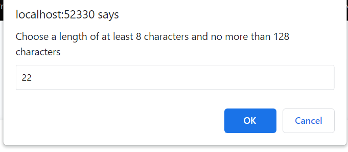
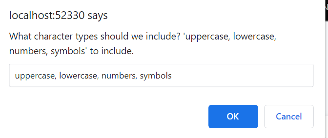
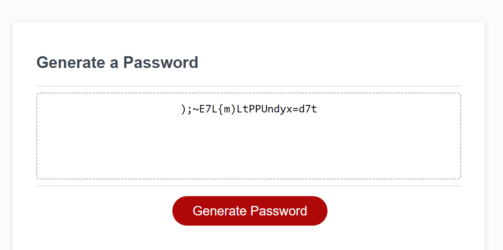

# password-gen
# <Portfolio>

## Description

This is my third challenge in the UCSD web dev course. The purpose of this site is to apply what I have learned in this course so far. The focus of this project was to really focus in on javascrip. The features of the website are as follows: 
- When someone clicks on the button to generate password they are given a series of prompts for the password criteria
- When someone is prompted for the length they can choose between 8 and 128 characters
- When someone picks a number outside our limits they get a message about it
- People have the option to include lowercase, uppercase, numerics, and special characters in the password
- When the password is generated it is displayed on the page
## Installation

Open the link in my GitHub Repo!

## Usage
- First click on the generate password button

- You will be presented with a prompt to choose the length, in this case we chose 22

- Next you will be prompted to pick the characters you want

- Here we picked all of the options

You should be presented with a randomly generated password!

- Here are some screenshots showing what happens when you pick a lengths outside of our limits

## Credits

- https://www.digitalocean.com/community/tutorials/js-array-search-methods

- https://developer.mozilla.org/en-US/docs/Web/JavaScript/Reference/Statements/while

- https://www.w3schools.com/

- https://coding-boot-camp.github.io/full-stack/github/professional-readme-guide

- https://www.youtube.com/watch?v=R6euByfGaN4

- https://www.w3docs.com/snippets/html/how-to-create-an-html-button-that-acts-like-a-link.html

- https://www.w3schools.com/htmL/html_images_background.asp

- https://www.w3schools.com/js/js_loop_while.asp

- https://developer.mozilla.org/en-US/docs/Web/JavaScript/Reference/Global_Objects/Array/filter